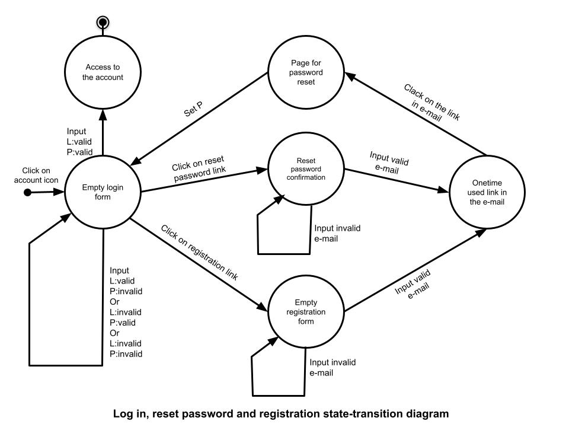
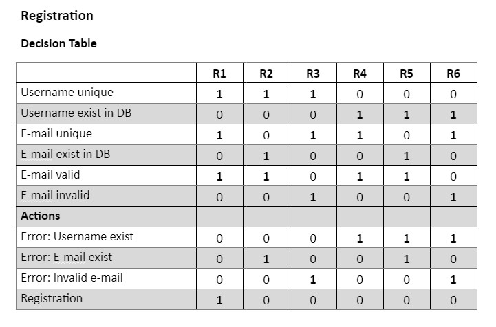

# Welcome to my portfolio!

I'm Maria Bezobiuk and I'm a junior QA/QC engineer, at the time - 
manual software tester.

I'm glad you are here. It means, you were interested in my [CV](cv.md) 
or social page and were curious, what is the level of my skills.

These are examples of my work products.

Mainly the site was tested - [newtea.ua](https://newtea.ua/)

At the time some work products aren´t up to site version.

-------

## Requirements
 
> The requirements should be documented, actionable, measurable, testable, 
> traceable, related to identified business needs or opportunities, 
> and defined to a level of detail sufficient for system design. (Wikipedia)

Requirement is something wanted or needed. And it´s necessary to know exactly
what do you want or need to recieve it and nothing else.

>**Requirement** - A provision that contains criteria to be fulfilled. (ISTQB)

Good requirements should have the following characteristics:

- *Unambiguous* There should be only one way to interpret the requirement.
- *Testable (verifiable)* Testers should be able to verify whether the 
requirement is implemented correctly. The test should either pass or fail.
- *Clear (concise, terse, simple, precise)* Requirements should not contain
 unnecessary verbiage or information. They should be stated clearly and simply
- *Correct* If a requirement contains facts, these facts should be true.
- *Understandable* Requirements should be grammatically correct and written 
in a consistent style. Standard conventions should be used. The word “shall” 
should be used instead of “will,” “must,” or “may.”
- *Feasible (realistic, possible)* The requirement should be doable within 
existing constraints such as time, money, and available resources.
- *Independent* To understand the requirement, there should not be a need 
to know any other requirement.
- *Atomic* The requirement should contain a single traceable element.
- *Necessary* A requirement is unnecessary if 1.none of the stakeholders 
needs the requirement or 2.removing the requirement will not affect the system.
- *Implementation-free (abstract)* Requirements should not contain 
unnecessary design and implementation information. 

Besides these criteria for individual requirements, three criteria apply 
to the set of requirements. The set should be:

- *Consistent* There should not be any conflicts between the requirements. 
Conflicts may be direct or indirect. Direct conflicts occur when, in the 
same situation, different behavior is expected. Indirect conflict occurs 
when requirements do not describe the same functionality, but it is not 
possible to fulfill both requirements at the same time.
- *Nonredundant* Each requirement should be expressed only once and 
should not overlap with another requirement
- *Complete* A requirement should be specified for all conditions that can occur.

Depending on the format, source, and common characteristics, the requirements
 can be split into different requirement types. Here are some requirement
 types that are often used in projects:

- *Stakeholder need*: a requirement from a stakeholder
- *Feature*: a service provided by the system, usually formulated by a 
business analyst; a purpose of a feature is to fulfill a stakeholder need
- *Use case*: a description of system behavior in terms of sequences of actions
- *Supplementary requirement*: another requirement (usually nonfunctional) 
that cannot be captured in use cases
- *Test case*: a specification of test inputs, execution conditions, and expected results
- *Scenario*: a specific sequence of actions; a specific path through a use case

One of the best practices of requirements management is to have at least 
two different levels of requirement abstraction. For example, the Vision 
contains high-level requirements (features), and the lower levels specifications
express the requirements at a detailed level. Senior stakeholders 
(such as vice presidents) do not have time to read 200 pages of detailed 
requirements but should be expected to read a 12-page Vision document.

 ------

## User stories

**User story** is a requirement written from a user position and can 
include any functional or non-functional user´s need, the reason behind it,
 and acceptance criteria.
 
There are some variants to write down user stories:  
- As a \<role\> I can \<capability\>, so that \<receive benefit\>
- In order to \<receive benefit\> as a \<role\>, I can \<goal/desire\>
- As \<who\> \<when\> \<where\>, I want \<what\> because \<why\> 
 
[File with user stories to the functionality](docfiles/requirements-to-functionality.pdf)

[File with user stories to UI](docfiles/requirements-UI.pdf)

------

## Use case diagram

The logic of some relationships between the use cases, actors, and systems 
can be visualised in **use case digram**. It´s usually simple and shows what 
behavior is expected in software underdeveloped. We can say, it is a primary 
form of system or software requirements and helps us design a system from 
the end user's perspective. 

 Use case diagram 

------

## Use Case

A **use case** is a list of actions or event steps typically defining the 
interactions between a role (known in the Unified Modeling Language (UML)
 as an actor) and a system to achieve a goal. 

> A use case is a scenario that describes the use of a system by an actor 
to accomplish a specific goal.

Use cases help us

- capture the system's functional requirements from the users' perspective
- actively involve users in the requirements-gathering process
- provide the basis for identifying major classes and their relationships
- serve as the foundation for developing system test cases

It is a usage scenario for a piece of software; often used in the plural to 
suggest situations where a piece of software may be useful.

Use cases organize requirements to form a narrative of how users relate 
to and use a system. Hence they focus on user goals and how interacting 
with a system satisfies the goals.
  
Use case flows describe sequences of interactions, and may be worded in 
terms of a formal model. A use case is intended to provide sufficient 
detail for it to be understood on its own.  

Template for use case:

- Title: "goal the use case is trying to satisfy"
- Main Success Scenario: numbered list of steps  
  - Step: "a simple statement of the interaction between the actor and a system"
- Extensions: separately numbered lists, one per Extension
  - Extension: "a condition that results in different interactions from .. 
the main success scenario". An extension from main step 3 is numbered 3a, etc.

Or

- Title (goal)
- Primary Actor
- Scope
- Level
- (Story): the body of the use case is simply a paragraph or two of text, 
informally describing what happens.

We can highlight such types of use cases:  

- System use cases specify the requirements of a system to be developed.  
- Business use cases focus on a business organisation instead of a software
 system. They are used to specify business models and business process 
 requirements in the context of business process reengineering initiatives.  
- Essential use cases, also called abstract use cases, describe the potential 
intents of the actors and how the system addresses these, without defining 
any sequence or describing a scenario. This practice was developed with 
the aim of supporting user-centric design and avoiding to induce bias about 
the user-interface in the early stage of the system specifications.  

[Use case](docfiles/use-case-registration.pdf) for registration.

------

## State-Transition Diagram

**State-transition diagram (STD)** is a visualisation of all the possible *states* 
of system, each variant of *event* from outside the system that cause changes 
in system, and *transition* to another state as a result of this event. 
Also on STD we can see the conditions that must be fulfilled before the 
transition will occure - *guards* and *actions* - activities undertaken 
during the life of an system.

Only valid state transitions may be utilized. 
 
It is used in the object-oriented modeling and developing as well as use case diagram.

For the tester there are three main questions to test these diagrams:

- Does the diagram follow the rules?
- Is the diagram correct?
- Does everything in this diagram trace back correctly and completely to 
its   predecessor?" and "Is everything in the predecessor reflected 
completely and   correctly in this diagram?"

<!--- State Transition Diagram for registration on newtea.ua.--->

------

## Decision Table

**Decision table** is a visual way to represent multiple conditions and 
actions for them or they combinations.  
Essentially it is a structured exercise to formulate requirements when 
dealing with complex business rules.

They provide a clear method to verify testing of all pertinent combinations
 to ensure that all possible conditions, relationships, and constraints 
 are handled by the software under test.

Decision table for registration on newtea.ua.

------

## Checklist

**Checklist** is a simpliest form of test documentation, I think. 
It´s a list of test activities needed to be done with checkbox done or not. 
It can contains a columns ¨Pass/Fail¨ and ¨Coments¨ for tester´s comfort :\) 

File with [checklist](docfiles/checklist-main-newtea.pdf) for main page testing.

------

## Test Cases

Test cases are the main artifacts for testing the software itself.

> **Test case** is a set of preconditions, inputs, actions (where applicable), expected 
> results and postconditions, developed based on test conditions. (ISTQB)

Test cases are typically written by members of the quality assurance (QA) 
team or the testing team and can be used as step-by-step instructions 
for each system test. Testing begins once the development team has finished 
a system feature or set of features. A sequence or collection of test cases 
is called a **test suite**.

Test cases define what must be done to test a system, including the steps 
executed in the system, the input data values that are entered into the 
system and the results that are expected throughout test case execution. 
Using test cases allows developers and testers to discover errors that 
may have occurred during development or defects that were missed during ad hoc tests.

The components of a test case include:

- *Test name.* A title that describes the functionality or feature that 
the test is verifying.
- *Test ID.* Typically a numeric or alphanumeric identifier that QA engineers 
and testers use to group test cases into test suites.
- *Objective.* Also called the description, this important component 
describes what the test intends to verify in one to two sentences.
- *References.* Links to user stories, design specifications or requirements 
that the test is expected to verify.
- *Prerequisites.* Any conditions that are necessary for the tester or QA 
engineer to perform the test.
- *Test setup. This component identifies what the test case needs to run 
correctly, such as app version, operation system, date and time requirements 
and security specifications.
- *Test steps.* Detailed descriptions of the sequential actions that must 
be taken to complete the test.
- *Expected results.* An outline of how the system should respond to each 
test step.

Before writing a test case, QA engineers and testing team members should 
first determine the scope and purpose of the test. This includes 
understanding the system features and user requirements as well as 
identifying the testable requirements.

See more about 5 commonly-used [test design techniques](test-design-techniques.md)

------

## Defect Reports

Defect or bug report is the basis artifact for improving the software.

> **Defect or bug report** is a documentation of the occurrence, nature, and status of a defect. (ISTQB)

I have made this [defect reports](docfiles/defect-report-1.pdf) and
[this in Excel](docfiles/defects-ua.xlsx) in Ukrainian.

<a href="docfiles/defects-ua.xlsx" target="_blank" Excel file</a>

------

## API Testing

> **Application programming interface (API)** is a type of interface in 
which the components or systems involved exchange information in a 
defined formal structure. (ISTQB)

Web APIs typically use HTTP for request messages and provide a definition 
of the structure of response messages. These response messages usually 
take the form of an XML or JSON file. Both XML and JSON are preferred 
formats because they present data in a way that’s easy for other apps 
to manipulate.

REST and SOAP are 2 different approaches to online data transmission. 
Specifically, both define how to build application programming interfaces 
(APIs), which allow data to be communicated between web applications.
The main difference is that SOAP is a protocol while REST is not.

**Simple object access protocol (SOAP)** is an official protocol 
maintained by the World Wide Web Consortium (W3C). 

APIs designed with SOAP use XML for their 
message format and receive requests through HTTP or SMTP. SOAP makes it 
easier for apps running in different environments or written in different 
languages to share information.

**Representational state transfer (REST)** is a set of architectural 
principles. 

When a request for data is sent to a REST API, it’s usually done through 
hypertext transfer protocol (commonly referred to as HTTP). Once a request 
is received, APIs designed for REST (called RESTful APIs or RESTful web 
services) can return messages in a variety of formats: HTML, XML, plain 
text, and JSON. JSON (JavaScript object notation) is favored as a message 
format because it can be read by any programming language (despite the 
name), is human- and machine-readable, and is lightweight. In this way, 
RESTful APIs are more flexible and can be easier to set up.

REST APIs are lightweight, making them ideal for newer contexts like the 
Internet of Things (IoT), mobile application development, and serverless 
computing. SOAP web services offer built-in security and transaction 
compliance that align with many enterprise needs, but that also makes 
them heavier. Additionally, many public APIs, like the Google Maps API, 
follow the REST guidelines.

File with [Postman](docfiles/postman.pdf) API REST testing.

File with [Fiddler](docfiles/fiddler.pdf) API REST testing.

Swagger.io is a simplify API development for users, teams, and enterprises 
with the Swagger open source and professional toolset. Find out how 
Swagger can help you design and document your APIs at scale.

------

## Automated testing 

Automated testing with Selenium IDE (Integrated Development Environment)

File with screenshots of testing with [Selenium IDE](docfiles/selenium-ide.pdf)

------

## SQL

> **Structured Query Language (SQL)** is a domain-specific language used 
in programming and designed for managing data held in a relational 
database management system (RDBMS), or for stream processing in a 
relational data stream management system (RDSMS). (Wikipedia)

A **relational DBMS** is an implementation of data stores according to the 
design rules of the relational model. 

The relational model designs data structures as relations (tables) with 
attributes (columns) and the relationship between those relations. The 
information about one entity of the real world is stored within one row 
of a table. 

This is example of using [SQL](docfiles/sql-lite.pdf)

------

## About me

I have a technical and analytical mindset. Since the school, I have been 
very attentive to details, trying to do my homework perfectly so sometimes 
I studyied slowly. My strength is the need for a deep understanding of the
learning material, which I absorb quickly, so it becomes part of me. 
This means that I can explain and use it anytime I needed.  

I have three children and sometimes help them with homework. 
This is rare because I´ve explained to them, that the lack of parts
on the base causes a misunderstanding of the next level of material. 

Also, I am a self-organized person. I studied HTML and the basics of Phyton in 
Sololearn app a few years ago. Also I´ve been studing SQL basis on it.
And I´ve created this site myself after I got first acquainted 
with Git and ultimate markdown. As you can see, I´m a self-taught and 
interested in IT person.

I took part in EPAM’s external course Software Functional Testing Winter 
Program 2022. I studied ISTQB foundation Syllabus and Software Testing - 
Base Course (Svyatoslav Kulikov).

Quality assurance interested me because in particular forms of quality 
control and testing it is needed at all stages of 
software development. It usually begins with testing requirements and work 
products, helps in the analysis and design stage, works closely with developers to create the 
best quality product and is needed in a partially automated form at the 
maintenance stage for regression testing. 

I understand that now my knowledge is not at the level of QA or even QC 
engineer, this is the tester level. But I know that I have a good and strong base
on which I can add practical and more specific knowledge and grow up!

