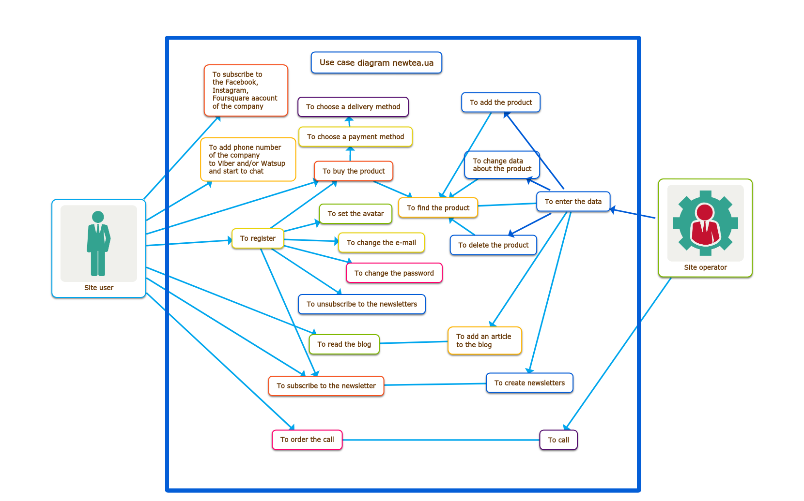
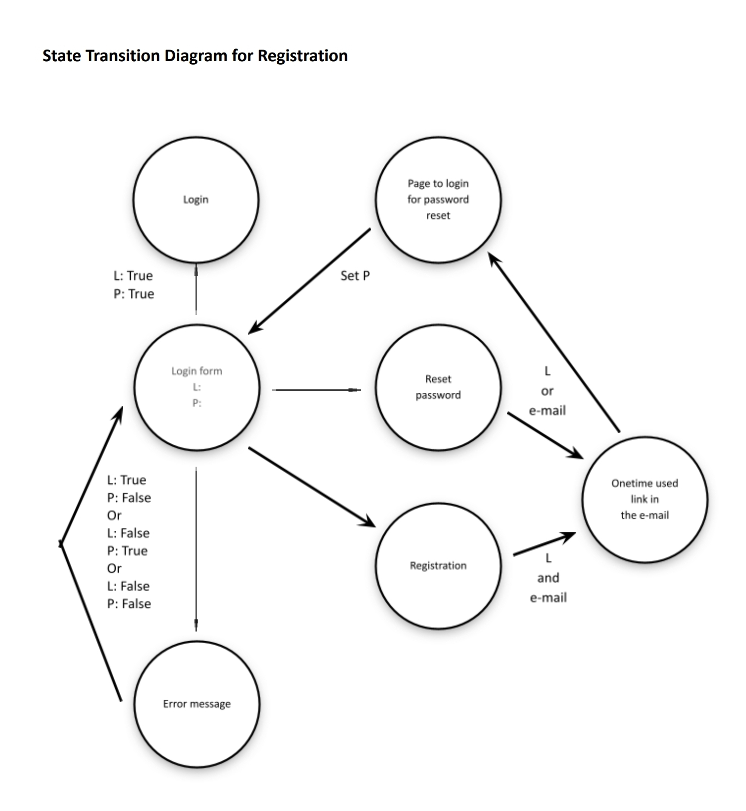

# Welcome to my portfolio!

I'm Maria Bezobiuk and I'm a junior QA/QC engineer, in another words - 
manual software tester. 

I'm glad you are here.  It means, you were interested in my CV or social page
 and were curious, what is the level of my skills.

These are examples of my work product.

The site was tested [newtea.ua](https://newtea.ua/)

Every test activity starts from analysis of project´s idea,

 ------

## User stories

**User story** is a requirement written from a user position and can 
include any functional or non-functional user´s need, the reason behind it,
 and acceptance criteria.
 
[file with user stories](docfiles/requirements-to-functionality.pdf)

[file with user stories to UI](docfiles/requirements-UI.pdf)

------

## Use case diagram

The logic of some relationships between the use cases, actors, and systems 
can be visualised in **use case digram**. It´s usually simple and shows what 
behavior is expected in software underdeveloped. We can say, it is a primary 
form of system or software requirements and helps us design a system from 
the end user's perspective. 

> A use case is a scenario that describes the use of a system by an actor to accomplish a specific goal.

Use cases help us

- capture the system's functional requirements from the users' perspective
- actively involve users in the requirements-gathering process
- provide the basis for identifying major classes and their relationships
- serve as the foundation for developing system test cases

Use case diagram

------

## Use Case

------

## State-Transition Diagram

**State-transition diagram /(STD/)** is a visualisation of all the possible *states* 
of system, each variant of *event* from outside the system that cause changes 
in system, and *transition* to another state as a result of this event. 
Also on STD we can see the conditions? that must be fulfilled before the 
transition will occure - *guards* and *actions* - activities undertaken 
during the life of an system.

Only valid state transitions may be utilized. 
 
It is used in the object-oriented modeling and developing as use case diagram.

For the tester there are three main questions to test these diagrams:

- Does the diagram follow the rules?
- Is the diagram correct?
- Does everything in this diagram trace back correctly and completely to 
its   predecessor?" and "Is everything in the predecessor reflected 
completely and   correctly in this diagram?"

State Transition Diagram for registration on newtea.ua.

------

## Decision Table

**Decision table** is a visual way to represent multiple conditions and 
actions for them or they combinations.  
Essentially it is a structured exercise to formulate requirements when 
dealing with complex business rules.

They provide a clear method to verify testing of all pertinent combinations
 to ensure that all possible conditions, relationships, and constraints 
 are handled by the software under test.

Decision table for registration on newtea.ua.

------

## Checklist

**Checklist** is a simpliest form of test documentation, I think.  
It´s a list of test activities needed to be done with checkbox done or not. 
It can contains a columns ¨Pass/Fail¨ and ¨Coments¨ for tester´s comfort :smirk:

[file with checklist](docfiles/checklist-main-newtea.pdf) for main page https://newtea.ua testing

------

------

## Testcases

